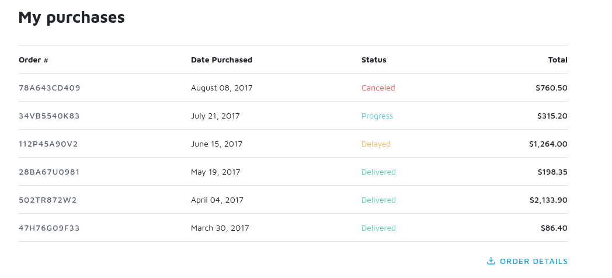

## Implementation of various UI components in HTML/CSS.

This is just me trying to reproduce various designs found on the web.

I try to keep the HTML markup as lean as possible (no extra
 divs for styling, etc.)

Keeping for reference and inspiration.

### Requirements:

```bash
npm install -g live-server
live-server --no-browser
```

---

### Tailwind signup

[tailwind-signup.html](tailwind-signup.html)


---

### Unishop table

[unishop-table.html](unishop-table.html)



